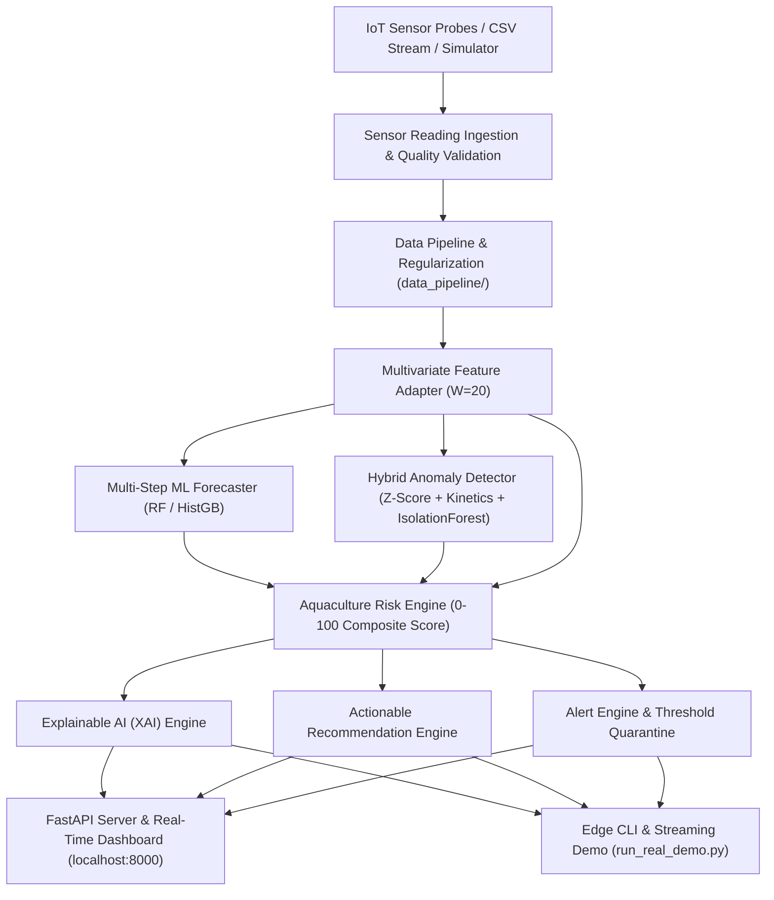

# System Architecture & Technical Specifications
## AI Aquaculture Guardian — Competition Architecture

---

## 1. End-to-End Pipeline Data Flow

---

## 2. Core Architectural Subsystems

### Subsystem 1: Ingestion & Validation (`data_pipeline/`, `ai/sensor_schema.py`)
- **`SensorReading`**: Validates sensor data types, timestamps, and physical plausibility boundaries ($0.0 \le \text{pH} \le 14.0$, $0.0 \le \text{Temp} \le 50.0^\circ\text{C}$, $0.0 \le \text{DO} \le 25.0\text{ mg/L}$).
- **`DatasetValidator`**: Audits duplicate timestamps, missing rates, and physical violations before training.

### Subsystem 2: Multivariate Feature Engineering (`data_pipeline/feature_adapter.py`, `ai/features.py`)
- Extracts 13 core pH lag and statistical features + 2 diurnal solar features + auxiliary sensor deltas (DO, Temp, Turbidity).
- Gracefully degrades to pH-only mode when auxiliary sensors are absent.

### Subsystem 3: Multi-Step Forecasting Engine (`ai/forecasting.py`, `models/real/`)
- Multivariate Random Forest Regressor trained under strict chronological 70/15/15 partitions.
- Evaluated at 1, 5, 15, and 30 steps ahead (5, 25, 75, 150 minutes).

### Subsystem 4: Hybrid Anomaly Detection (`ai/anomaly.py`)
- Integrates Rolling Z-Score ($|Z| > 2.5$), Rate of Change Kinetics ($|\Delta \text{pH}| > 0.15\text{ / 5 min}$), Stuck Flatline Sensor ($\sigma^2 = 0$ for $\ge 15$ steps), and Isolation Forest.

### Subsystem 5: Composite Risk Scoring (`ai/risk.py`)
- Deterministic formula synthesizing Current Value (35%), Forecast (25%), Rate of Change (15%), Trend (10%), Anomaly (15%), and Sensor Quality multiplier into a bounded $0 - 100$ score.

### Subsystem 6: Explainable AI & Decision Support (`ai/explainability.py`, `ai/recommendations.py`)
- Translates numerical risk factors into plain-language biological summaries and conservative farm standard operating procedures.

### Subsystem 7: Edge Runtime & Intel® OpenVINO™ (`edge/inference_engine.py`)
- Provides OpenVINO IR conversion abstraction with transparent scikit-learn CPU fallback logging.
