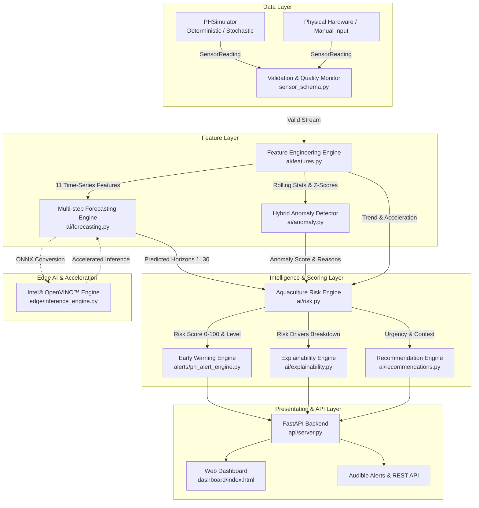

# System Architecture & Technical Specifications
## AI Aquaculture Guardian — Competition Edition

---

## 1. High-Level Architecture Overview

---

## 2. Mathematical Formulations

### 2.1 Feature Engineering ($11$ Dimensional Vector)
Given time-series history $x_{t-W+1}, \dots, x_t$ with window $W=20$:
1. $f_1 = x_t$ (Current value)
2. $f_2 = \mu_W = \frac{1}{W} \sum_{i=0}^{W-1} x_{t-i}$ (Rolling mean)
3. $f_3 = \sigma_W = \sqrt{\frac{1}{W} \sum (x_{t-i} - \mu_W)^2}$ (Rolling standard deviation)
4. $f_4 = \min_{i} x_{t-i}$ (Rolling minimum)
5. $f_5 = \max_{i} x_{t-i}$ (Rolling maximum)
6. $f_6 = \beta_1$ where $\arg\min_{\beta_0, \beta_1} \sum (x_{t-i} - (\beta_0 + \beta_1 \cdot i))^2$ (Linear slope/trend)
7. $f_7 = \Delta x_t = x_t - x_{t-1}$ (First difference / rate of change)
8. $f_8 = x_t - x_{t-W+1}$ (Window delta)
9. $f_9 = \Delta^2 x_t = (x_t - x_{t-1}) - (x_{t-1} - x_{t-2})$ (Second difference / acceleration)
10. $f_{10} = \sin\left(\frac{2\pi \cdot \text{hour}}{24}\right)$ (Cyclical time-of-day sine component)
11. $f_{11} = \cos\left(\frac{2\pi \cdot \text{hour}}{24}\right)$ (Cyclical time-of-day cosine component)

### 2.2 Aquaculture Risk Scoring ($0 - 100$)
$$R_{\text{total}} = w_1 R_{\text{current}} + w_2 R_{\text{forecast}} + w_3 R_{\text{trend}} + w_4 R_{\text{anomaly}}$$

Where default weights $\mathbf{w} = [0.30, 0.30, 0.20, 0.20]$ and:
- **Deviation Score ($R_{\text{current}}, R_{\text{forecast}}$)**:
  $$\text{If } \text{pH} \in [7.0, 8.5] \implies R_{\text{dev}} = \max\left(0, 30 \cdot \left(1 - \frac{\min(\text{pH}-7.0, 8.5-\text{pH})}{0.75}\right)\right)$$
  $$\text{If } \text{pH} \notin [7.0, 8.5] \implies R_{\text{dev}} = \min(100, 30 + |\text{overshoot}| \cdot 140)$$
- **Trend Score ($R_{\text{trend}}$)**:
  $$R_{\text{trend}} = \min(100, (0.6 \cdot |\text{RoC}| + 0.4 \cdot |\text{Slope}|) \times 500)$$
- **Anomaly Score ($R_{\text{anomaly}}$)**:
  $$R_{\text{anomaly}} = \text{Score}_{\text{anomaly}} \times 100$$

### 2.3 Risk Levels
| Total Score | Level | Description | Recommended Action |
|---|---|---|---|
| $0 - 20$ | **LOW** | Stable optimal conditions | Routine monitoring |
| $21 - 40$ | **MODERATE** | Minor fluctuations observed | Standard 30m check |
| $41 - 60$ | **ELEVATED** | Early warning or subtle anomalies | Increase check to 10-15m |
| $61 - 80$ | **HIGH** | Predicted breach or sharp drift | Inspect aeration & water buffers |
| $81 - 100$ | **CRITICAL** | Measured breach or extreme risk | Immediate verification & emergency protocol |

---

## 3. Intel® OpenVINO™ Integration Specs

- **Model format**: scikit-learn `RandomForestRegressor` exported to `ONNX` via `skl2onnx` $\to$ read into `openvino.Core()`.
- **Target Devices**: `CPU`, `GPU.0`, `NPU` (automatic device discovery).
- **Fallback Strategy**: Built-in `SklearnInferenceEngine` fallback ensures zero downtime if specific model layers are unsupported.
- **Latency & Throughput**: Micro-benchmarking with P50, P95, P99 percentile tracking.

---

## 4. Multi-Sensor Scaling Roadmap

The `SensorReading` schema is pre-built to support expansion to:
1. **Dissolved Oxygen (DO)** (Unit: mg/L, Range: 0–25 mg/L, Critical threshold: < 4.0 mg/L)
2. **Water Temperature** (Unit: °C, Range: 0–45 °C, Optimal: 28–32 °C)
3. **Turbidity** (Unit: NTU, Range: 0–4000 NTU)
4. **Total Ammonia Nitrogen (TAN / NH3)** (Unit: mg/L, Critical threshold: > 0.1 mg/L un-ionized)
